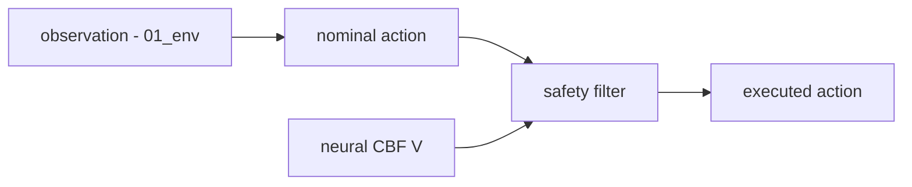

# 02 — Control

In RL terms `01_env` is the environment; this document is the **agent**: everything that
turns an observation into an executed action. It defines the nominal policy, the neural CBF
(value function), the two safety filters (CBF-QP and HardNet projection), the learned
control network, and the infeasibility signal.

It defines **structure and interfaces**, not learning. How these parts are trained (losses,
co-training, two-buffer collection, schedules, BPTT length, warmup) belongs to `03_train`.
The observation and action are taken exactly as defined in `01_env`; this document does
not redefine them.

## 0.1 What is fixed here vs set in config

- **Fixed here (structure):** the pipeline; the LQR formulation; the value-network family
  and sign convention; the two safety-filter formulations; the infeasibility definition;
  the gradient/differentiability conventions.
- **`base_config.yaml`** (rarely-changed values): LQR `Q`/`R`; value-net depth/width and
  head; ensemble size; HardNet `epsilon`; CBF-QP `penalty`, relaxation and solver
  iterations; agent safety margin `gamma_margin`; control-net width.
- **`exp_config.yaml`** (per-experiment tunables): class-K $\alpha_{\text{safe}}$ /
  $\alpha_{\text{unsafe}}$.

---

## 1. Control pipeline

A base action is produced by a nominal policy and then projected to a safe action by a
safety filter:



The nominal action comes from either the analytic **LQR** (§2) or a **learned control
network** (§6.2). The safety filter is one of **CBF-QP** (§5) or **HardNet projection**
(§6). This yields three executable paths used across the project:

- **LQR-only** — nominal LQR, no filter. The analytic baseline (per the
  "establish baselines" principle).
- **CBF-QP filtered** — used by OC-PNCBF at deployment. Not differentiable (§7).
- **HardNet filtered** — used by Joint Training; differentiable, enabling policy/value
  co-training through the projection.

---

## 2. Nominal policy (LQR)

The nominal policy is LQR. `Q`/`R` values are in `base_config.lqr.*` (defaults below).

- **Double Integrator.** LQR on $[px, py, vx, vy]$ with the continuous double-integrator
  $(A, B)$; gain from the continuous algebraic Riccati equation. Action
  $u = -K (x - [g_x, g_y, 0, 0])$, clamped to control bounds.
  Defaults: $Q = \mathrm{diag}(1.0, 1.0, 0.1, 0.1)$, $R = 1.0 \cdot I$.
- **Unicycle.** LQR on the virtual state
  $z = [px, py, v\cos\theta, v\sin\theta]$ (same double-integrator $(A, B)$ structure),
  producing a virtual acceleration $u_v = -K(z - [g_x, g_y, 0, 0]) \in \mathbb{R}^2$. The
  virtual acceleration is mapped to physical $[a, \omega]$ by projecting onto the heading
  frame:
  $$
  a = u_v \cdot \hat e_\theta,
  \qquad
  \omega = \frac{u_v \cdot \hat e_\theta^{\perp}}{v_{\text{safe}}},
  \qquad
  v_{\text{safe}} = \mathrm{sign}(v)\cdot \max(|v|,\ v_{\min}),
  $$
  where $\hat e_\theta = (\cos\theta, \sin\theta)$ is the heading direction,
  $\hat e_\theta^{\perp} = (-\sin\theta, \cos\theta)$ the lateral direction, and
  $v_{\min} = \texttt{lqr.unicycle.v\_min}$ (default 0.1). The signed $v_{\text{safe}}$
  preserves turn direction at low and reversing speeds and avoids division by a small
  magnitude. Both $a$ and $\omega$ are clamped to control bounds.
  Defaults: $Q = \mathrm{diag}(0.5, 0.5, 0.1, 0.1)$, $R = 0.5 \cdot I$.

---

## 3. Neural CBF (value function)

### 3.1 Input and output

The value network takes exactly the `01_env` observation and outputs a scalar **signed
safety value** $h(x, \text{obs})$. Sign convention matches `01_env`: $h \leq 0$ safe,
$h > 0$ unsafe. The network learns the policy-conditioned value (the worst future safety
under the operating policy); it is not the instantaneous geometric $h$ of `01_env`, but
shares its sign.

### 3.2 Network

Canonical trunk: MLP with `network.value.n_layers = 3` hidden layers of width
`network.value.hidden = 256`, $\mathrm{Softplus}(\beta = 20)$ activations
(`network.value.softplus_beta`). **The smooth activation is required, not stylistic:** the
filters compute $L_f h$ and $L_g h$ by autograd through this network (§7), and the policy
BPTT differentiates that gradient again (a second derivative of $h$). A piecewise-linear
activation (ReLU) has a discontinuous first derivative and a near-everywhere-zero second
derivative, which makes $L_g h$ jagged and the BPTT gradient unstable; $\mathrm{Softplus}$
is $C^\infty$. $\beta = 20$ keeps the activation close to ReLU's expressiveness while
remaining smooth.

Weight initialization is PyTorch's default `nn.Linear` initialization; no custom
initializer is used in v2.0.0.

**Output head: unbounded linear, clipped to $[-1, 1]$ only at read-out.** The network
`forward` produces a raw linear scalar (no bounding activation). The clip to $[-1, 1]$ is
applied in the `value()` read-out path used for deployment and eval, not inside `forward`;
the training MSE regresses the raw (unclipped) `forward` output against the clamped target.
A bounding head such as tanh is avoided: tanh saturates near the bound and drives
$\partial V / \partial x \to 0$ there, which flattens $\nabla h$ on the safe side and
starves the CBF-QP of control authority. A raw-linear forward with read-out clip keeps the
gradient alive inside the clip range (gradient is zero only exactly outside it), preserving
obstacle-direction signal in the safe region.

### 3.3 Class-K term

The CBF condition uses a state-dependent class-K gain $\alpha$:
$\alpha_{\text{safe}}$ where $h \leq 0$, $\alpha_{\text{unsafe}}$ where $h > 0$. Values in
`exp_config.filter.*` (per-experiment, because conservativeness is the most tunable knob).
Defaults: $\alpha_{\text{safe}} = 2.0$, $\alpha_{\text{unsafe}} = 100.0$ (the large unsafe
gain pulls strongly back toward the safe set).

### 3.4 Ensemble

Ensemble size `network.value.n_vs = 2`. Combination convention:
**min over members for the training target** (conservative-for-learning, prevents an
optimistic outlier from driving the regression target down) and **mean over members for
the deployed $h$**. Member values are clipped to $[-1, 1]$ before both the min (target) and
the mean (deployed) aggregation.

### 3.5 Value-network-to-filter adapter

The safety filters (§5, §6) consume an `h_fn(x, scene)` callable, not a value network
directly. The canonical adapter that bridges the two is

```python
make_h_fn(value_net, system, use_target=False) -> Callable[[Tensor, Scene], Tensor]
```

It returns `h_fn(x, scene) = value_net.target_h(system.observation(x, scene))` when
`use_target` is true (the conservative min-ensemble target, used for collection), and
`deployed_h` (the mean-ensemble deployed value) otherwise (used at deployment and eval).
Because the value reads velocity through the observation, $\partial h / \partial x$ has
nonzero velocity components, which is what gives the first-order filters control authority
(see the relative-degree remark in §5.1). This adapter is the only sanctioned way to use a
value network as a filter `h_fn`; frameworks do not construct ad-hoc closures.

---

## 4. Infeasibility

A step is **infeasible** when the safety filter cannot return a strictly feasible safe
action within the control bounds. Concretely, per active filtered step:

- **CBF-QP:** the slack variable is active, $r > 10^{-4}$.
- **HardNet:** the constraint is singular ($\|L_g h\| < 5 \times 10^{-4}$) or, in
  box-aware mode, the half-space and the control box have empty intersection so the
  projection must fall back to the least-violating action.

Aggregation (canonical, per the agreed metric): per episode, infeasibility is the **mean
over active steps** of the per-step infeasible flag; the reported `infeasibility` is the
mean over episodes. This is the `infeasibility` term consumed by `cps` in `03_train` /
`04_eval`.

### 4.1 Saturation rate

A separate per-step diagnostic, **not** part of `cps`. A step is **saturated** when any
component of the executed action $u^{\text{safe}}$ lies within $10^{-3}$ of its own bound
(the per-component min or max in `system.u_bounds`):

$$
\text{sat}_t = \mathbb{1}\!\left[\ \exists\, i:\
\min\!\big(|u^{\text{safe}}_{t,i} - u^{\text{lo}}_i|,\
|u^{\text{safe}}_{t,i} - u^{\text{hi}}_i|\big) \le 10^{-3}\ \right].
$$

Per episode, the **saturation rate** is the mean of $\text{sat}_t$ over active filtered
steps (saturated steps / total active steps); the reported value is the mean over
episodes. It measures how hard the filtered controller rides the control limits (high rate
implies frequent saturation / bang-bang actuation) and is recorded as an evaluation
diagnostic in `04_eval`, never folded into `cps`.

---

## 5. Safety filter A — CBF-QP (proxsuite)

Used by OC-PNCBF (and as the deployment filter generally).

### 5.1 Formulation

Decision vector $[u, r]$ with slack $r$:

- Objective:
  $\min \tfrac{1}{2}\|u - u^{\text{nom}}\|^2 + \tfrac{1}{2}\, \text{penalty}\cdot r^2$
  (proxsuite dense QP).
- CBF row:
  $L_g h \cdot u - r \;\leq\; -L_f h \;-\; \alpha\, h_{\text{eff}}$,
  with $h_{\text{eff}} = h + V_{\text{SHIFT}} + \gamma_{\text{margin}}$. Here
  $\gamma_{\text{margin}}$ is the **agent safety margin** (how conservative the agent is),
  in `base_config.filter.gamma_margin` (default 0.0); $V_{\text{SHIFT}} = 10^{-3}$ is a
  numerical offset.
- Box constraints: $u_{\text{lo}} \leq u \leq u_{\text{hi}}$ (from `01_env` control
  bounds); $r \geq -\text{relax\_eps1}$.

Config defaults (`base_config.filter.cbf_qp.*`):
$\text{penalty} = 10.0$, $\text{relax\_eps1} = 0.5$,
$V_{\text{SHIFT}} = 10^{-3}$, solver $\text{max\_iter} = 500$,
$\text{max\_iter\_in} = 100$, solver convergence tolerance
$\text{eps\_abs} = 10^{-9}$. The batched solve parallelizes per-row over at most
`base_config.filter.cbf_qp.max_workers` CPU threads (default 32) when the installed
solver does not expose a vectorized API.

**Relative-degree remark (REQUIRED reading).** The first-order CBF row above only
constrains the action when $L_g h \neq 0$. For both v2.0.0 systems the *instantaneous
geometric* signed-h of `01_env` §1.4 depends only on position; since the action enters
acceleration/turn-rate, not position, geometric-h is **relative degree 2** and yields
$L_g h = 0$ — a first-order CBF-QP has no control authority on it. Therefore geometric-h
is valid only for labels, outcomes, and structural tests, **never** as a deployment
`h_fn`. A usable `h_fn` must have nonzero $L_g h$, which the learned policy-conditioned
value $V_S$ provides because it depends on velocity through the observation (§3.5).

### 5.2 Solver correctness (REQUIRED)

A verification harness in `src/common/` runs unit tests that must pass before any
framework is allowed to use the filter (`05_code` §5). On a fixed battery of
$(h, L_f h, L_g h, u^{\text{nom}}, \text{bounds})$ cases the tests check:

1. the solver-reported primal and dual residuals are below tolerance (this is the
   accepted operational definition of "KKT residual" for v2.0.0; the implementation is not
   required to independently assemble stationarity / complementarity / active-set
   residuals);
2. the returned $u$ satisfies the CBF and box constraints within tolerance (slack
   accounted for);
3. the solution matches an independent reference solver (OSQP or cvxpy) within tolerance.

A second test verifies **HardNet vs L2-QP agreement** for $\varepsilon = 0$, single
half-space, box-inactive, feasible cases.

---

## 6. Safety filter B — HardNet projection and the control network

Used by Joint Training; differentiable, so policy and value co-train through it.

### 6.1 Closed-form projection

Half-space $A \cdot u \leq b$ with $A = L_g h$, $b = -L_f h - \alpha h$. Base projection:

$$
u^{\text{safe}} = u^{\text{nom}} \;-\; \frac{A}{\|A\|^2 + \varepsilon^2}\,
\mathrm{ReLU}\!\big(A \cdot u^{\text{nom}} - b\big),
$$

with $\varepsilon = \texttt{base\_config.filter.hardnet.epsilon}$ (default
$5 \times 10^{-4}$), then clamped to control bounds. As in §5.1, this projection only
moves the action when $L_g h \neq 0$; the relative-degree remark of §5.1 applies
identically — geometric-h ($L_g h = 0$) is not a valid HardNet `h_fn`, only a
velocity-dependent learned $V_S$ is.

A **box-aware** mode (`base_config.filter.hardnet.box_aware = true`) selects the exact
closest point of $\{A \cdot u \leq b\} \cap [\text{bounds}]$. For the **2-D action**
systems of v2.0.0 the candidate set is finite and enumerated explicitly: the clamped
nominal action, the clamped base projection, the four box corners, and the intersections
of the half-space boundary with each box edge. The closest feasible candidate is selected
(`torch.argmin` on squared distance, ties resolved by lowest candidate index); if none is
feasible, the least-violating candidate is returned and the step is flagged infeasible
(§4). Candidate selection is non-differentiable, but gradients flow through the selected
candidate. Numerical tolerances ($10^{-9}$ for feasibility, $10^{-12}$ for degenerate
edges) are local constants. **Scope:** this enumerator is defined only for 2-D action
spaces; before adding a higher-action system (e.g. a 6-D quadrotor) it must be replaced by
a dimension-general exact box/half-space projection, or its finite-candidate rule and
approximation status must be re-specified. This is a one-axis prerequisite for any new
high-dimensional system, not a v2.0.0 task.

### 6.2 Main control network (learned policy)

The learned policy produces the pre-projection action $u^{\text{nom}}$. Canonically it is
a plain **MLP** with `network.control.n_layers` hidden layers of width
`network.control.hidden` (defaults 2 and 256) and **LeakyReLU** hidden activations
(`network.control.activation = leaky_relu`, negative slope 0.01). Unlike the value network
(§3.2), the policy does not require a smooth second derivative — its output is not
differentiated twice — so LeakyReLU is used for its training efficiency; the smoothness
the BPTT path needs comes from the value network inside HardNet, not from the policy.
Weight initialization is PyTorch default. Its input is the `01_env` observation and its
output is the `01_env` action, scaled to the control bounds by a bounded map
(`network.control.output`: softsign or tanh; default softsign). Input and output
dimensions follow `01_env` and are not redefined here.

The pre-tanh activation $z$ (or pre-softsign activation, equivalent role) is exposed by
the network as an attribute so the policy regularizers in `03_train` §4.4 can reference
it.

### 6.3 Role

Because this path is differentiable (§7), it is the filter used for JT co-training. The
CBF-QP path (§5) is for OC-PNCBF / deployment.

---

## 7. Gradient and differentiability

- **$\partial h / \partial x$** is obtained by autograd through $\text{obs}(x)$ and then
  the value network (not an analytic network derivative). $L_f h$ and $L_g h$ are then
  assembled per system: Double Integrator
  $L_f h = \partial h/\partial px \cdot vx + \partial h/\partial py \cdot vy$,
  $L_g h = [\partial h/\partial vx,\ \partial h/\partial vy]$; Unicycle through the
  body-frame features. Because observations are translation-invariant
  ($\text{rel} = \text{center} - \text{position}$) and, for the unicycle, body-frame,
  autograd carries the correct chain-rule terms for the selected Top-K obstacles.
- **HardNet path** is differentiable for policy BPTT (`create_graph=True`): gradients flow
  through the policy, the projection tensor ops, the RK4 dynamics, and the
  state-dependent $h$ gradient. During the policy update the value network $V_S$ is
  **detached / frozen** so no gradient reaches V parameters; a gradient-leak check enforces
  this (halt if the V-param gradient from the policy loss exceeds $10^{-9}$, see
  `03_train` §4.7).
- **CBF-QP path (proxsuite)** is **not** differentiable end-to-end: it converts to NumPy,
  solves, and returns detached arrays. It is therefore a deployment/OC filter, not a
  co-training filter.
